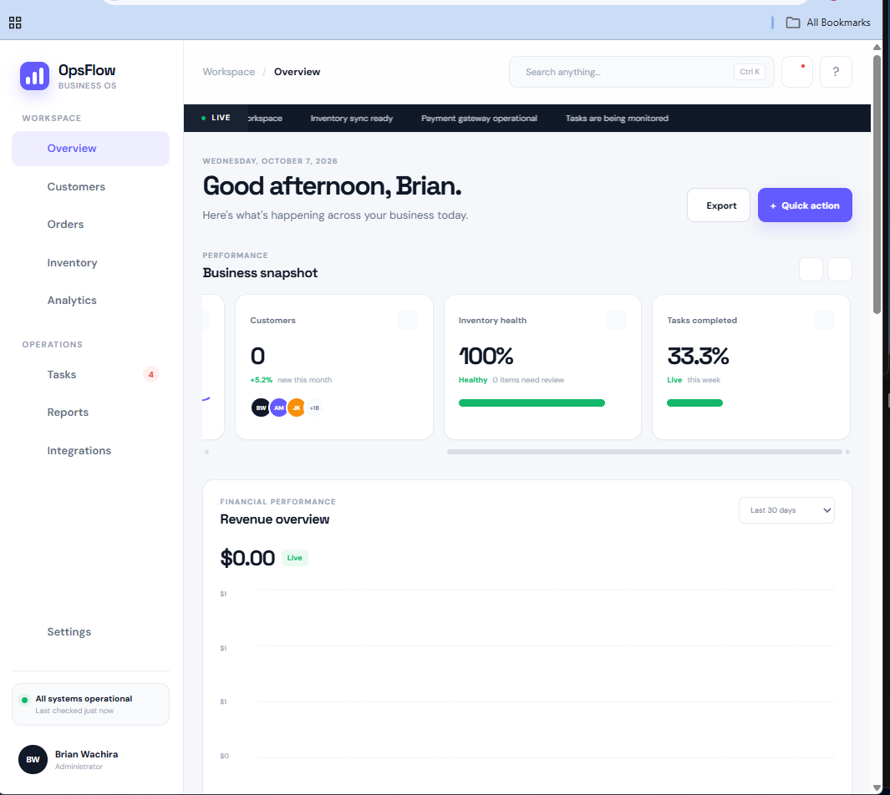
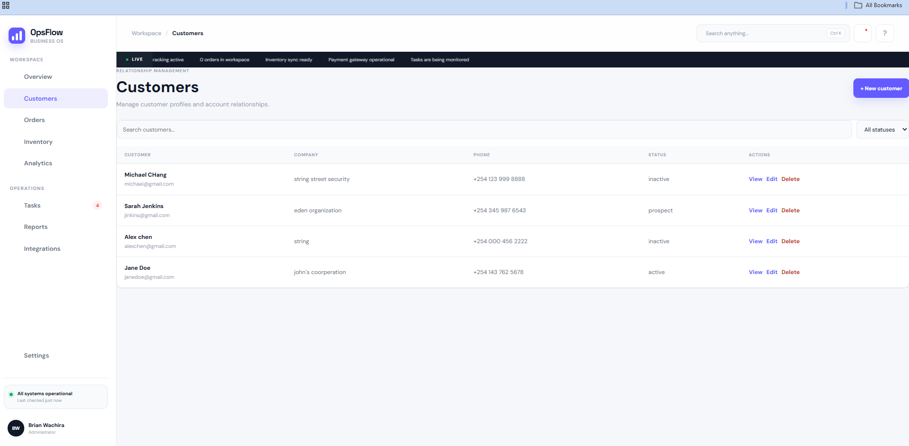
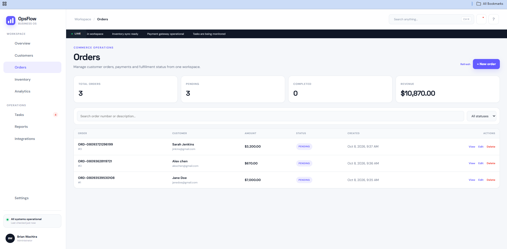
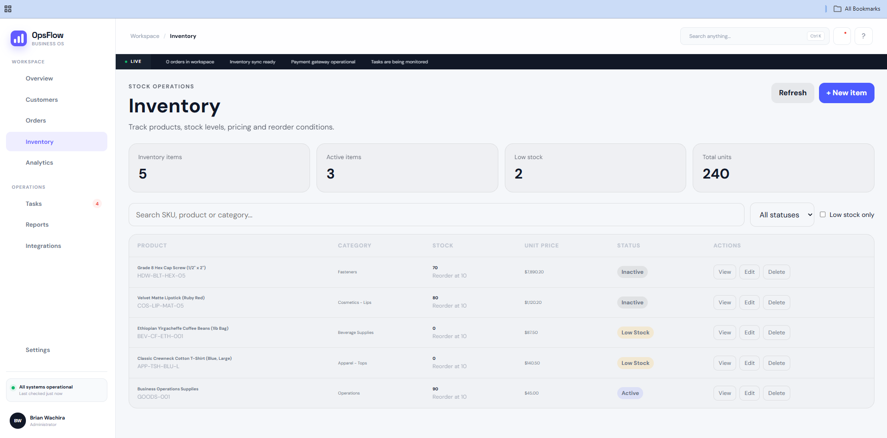
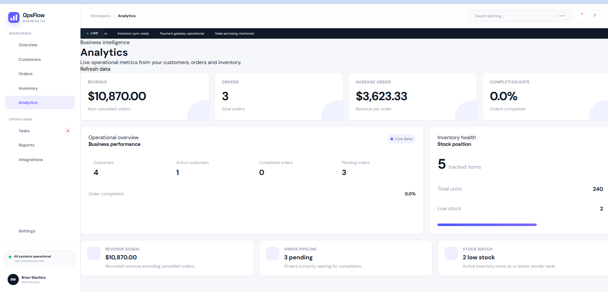

# OpsFlow — Business Operations Platform
[](https://github.com/bwachira649/business-operations-platform/actions/workflows/ci.yml) [](https://github.com/bwachira649/business-operations-platform/blob/main/LICENSE)


> **A full-stack business operations platform for managing customers, orders, inventory, analytics, tasks, and operational reporting from a unified workspace.**

OpsFlow is a modern business operations application built around real operational workflows rather than isolated demo features.

It provides a unified workspace where business users can monitor operations, manage customer and order workflows, track inventory, review analytics, and work with operational tasks and reports.

The project demonstrates practical full-stack engineering across **Python, FastAPI, SQLAlchemy, REST APIs, SQLite, HTML, CSS, JavaScript, automated testing, database migrations, Git, and Git LFS**.

---

## Product Evidence

The screenshots and workflow recordings below were captured from the **working OpsFlow application**.

### Operations Overview

The main dashboard provides a centralized operational view with business KPIs, revenue, orders, customers, inventory health, tasks, activity, and system status.



### Customers Workspace

The Customers workspace supports customer discovery, status filtering, customer metrics, and customer creation workflows.



**Workflow:**
[▶ Watch Customers — New Customer Workflow](docs/evidence/videos/01-customers-workspace.new%20customer.mp4)

[▶ Watch Customers UI Workflow](docs/evidence/videos/04-customers-ui-workflow.mp4)

### Orders Workspace

The Orders workspace provides order visibility, operational metrics, order status information, and order creation workflows.



**Workflow:**
[▶ Watch Orders — New Order Workflow](docs/evidence/videos/02-orders-workspace.%20new%20order.mp4)

### Inventory Workspace

The Inventory workspace provides inventory visibility, quantities, health indicators, review information, and inventory creation workflows.



**Workflow:**
[▶ Watch Inventory — New Inventory Workflow](docs/evidence/videos/03-inventory-workspace.new%20inventory.mp4)

### Analytics Workspace

The Analytics workspace provides business and operational metrics for understanding activity across the platform.



### Additional Operational Workflows

The repository also contains recordings of additional working areas of the application:

* [▶ Tasks Workspace](docs/evidence/videos/05-tasks-workspace.mp4)
* [▶ Reports Workspace](docs/evidence/videos/06-reports-workspace%20.mp4)

> **Evidence note:** These screenshots and recordings are real project evidence captured from the working application. They are included to demonstrate actual implemented workflows rather than mockups or placeholder screens.

---

## Why OpsFlow?

Many small and growing businesses manage operational information across disconnected spreadsheets, messages, documents, and separate tools.

OpsFlow explores how these workflows can be brought together into a single operational interface.

The platform focuses on four practical questions:

* **What is happening in the business?**
* **What requires attention?**
* **Where are customers, orders, and inventory in their workflows?**
* **How can operational information be presented clearly enough to support decisions?**

This makes OpsFlow more than a CRUD demonstration. The application connects data, workflows, operational metrics, and user-facing visibility into one product.

---

## Core Capabilities

### Business Operations Dashboard

* Centralized operational overview
* Revenue and order metrics
* Customer metrics
* Inventory health
* Operational completion indicators
* Business health scoring
* Activity visibility
* Live operational status indicators

### Customer Management

* Searchable customer records
* Customer status filtering
* Customer summary metrics
* Customer creation workflow
* API-backed customer data
* Connected API status visibility

### Order Management

* Order workspace
* Order creation workflow
* Order status information
* Order metrics
* API-backed order data

### Inventory Management

* Inventory records
* Quantity tracking
* Inventory health monitoring
* Low-stock/review indicators
* Inventory creation workflow
* Operational inventory metrics

### Analytics

* Revenue metrics
* Order metrics
* Customer metrics
* Inventory health
* Operational completion metrics
* Business health scoring
* Activity and performance visualization

### Operations

* Tasks workspace
* Reports workspace
* Integrations workspace
* Global search
* Workspace-based navigation
* Operational status indicators

---

## Frontend Experience

OpsFlow was designed as a modern software product rather than a traditional portfolio CRUD interface.

The interface includes:

* Responsive dashboard layout
* Workspace-oriented navigation
* Horizontal KPI rail
* Live status ticker
* Interactive data panels
* Search interface
* Operational health indicators
* Clear information hierarchy
* API-connected workspaces
* Business-oriented visual language

The design direction emphasizes **information density without sacrificing usability**, allowing users to move between operational areas without leaving the application.

---

## Technology Stack

| Layer                | Technologies          |
| -------------------- | --------------------- |
| Backend              | Python, FastAPI       |
| Data validation      | Pydantic              |
| ORM / Database       | SQLAlchemy, SQLite    |
| API                  | REST                  |
| Frontend             | HTML, CSS, JavaScript |
| Testing              | pytest                |
| Code Quality         | Ruff                  |
| Version Control      | Git                   |
| Large Evidence Files | Git LFS               |
| Database             | Migrations / SQLite   |

---

## Architecture

```text
business-operations-platform/
│
├── data/
│   └── application data
│
├── docs/
│   └── evidence/
│       ├── images/
│       └── videos/
│
├── migrations/
│   └── database migration resources
│
├── scripts/
│   └── operational utilities
│
├── src/
│   └── backend application
│
├── tests/
│   └── automated test suite
│
├── web/
│   ├── index.html
│   └── static/
│       ├── main.js
│       └── frontend assets
│
├── .gitattributes
├── .gitignore
├── pyproject.toml
└── README.md
```

---

## Getting Started

### Requirements

* Python 3.14+
* Git
* Modern web browser

### Clone the Repository

```bash
git clone https://github.com/bwachira649/business-operations-platform.git
cd business-operations-platform
```

### Create a Virtual Environment

#### Windows PowerShell

```powershell
py -3.14 -m venv .venv
.\.venv\Scripts\Activate.ps1
```

#### Linux / macOS

```bash
python3 -m venv .venv
source .venv/bin/activate
```

### Install Dependencies

```bash
python -m pip install --upgrade pip
pip install -e .
```

### Run Tests

```bash
pytest -q
```

### Run Ruff

```bash
ruff check .
```

---

## Quality Verification

The application has been verified with automated tests and static analysis.

### Test Suite

```text
33 passed
```

### Ruff

```text
All checks passed!
```

Run the checks locally with:

```bash
pytest -q
ruff check .
```

The goal is to keep application behavior verifiable through automated tests rather than relying only on manual UI demonstrations.

---

## API

OpsFlow uses a REST API to connect the frontend with backend business workflows.

The API provides application resources for areas such as:

* Customers
* Orders
* Inventory
* Operational data
* Health/status information
* Analytics-related information

A locally running development instance can be accessed through:

```text
http://127.0.0.1:<port>
```

API endpoints can be tested independently of the frontend.

This separation allows the backend workflows and frontend experience to be developed and verified independently.

---

## Evidence & Reproducibility

The repository includes both visual and workflow evidence.

### Screenshots

Located in:

```text
docs/evidence/images/
```

Current evidence covers:

* Operations Overview
* Customers
* Orders
* Inventory
* Analytics

### Workflow Recordings

Located in:

```text
docs/evidence/videos/
```

Current recordings cover:

* Customer creation
* Customer UI workflow
* Order creation
* Inventory creation
* Tasks
* Reports

Large video evidence files are managed with **Git LFS** where appropriate.

---

## Security Considerations

OpsFlow is currently a portfolio and development application and should **not be treated as a production-hardened business system** without additional security work.

A production deployment would require additional controls such as:

* Authentication
* Role-based authorization
* Secrets management
* HTTPS/TLS
* Rate limiting
* Secure database configuration
* Audit logging
* Backup and recovery
* Monitoring and alerting
* Secure production configuration
* Dependency and vulnerability management

No production credentials or secrets should be committed to this repository.

See [SECURITY.md](SECURITY.md) for security reporting guidance.

---

## Development

Development guidelines are available in [CONTRIBUTING.md](CONTRIBUTING.md).

Before submitting changes:

```bash
ruff check .
pytest -q
```

For frontend changes, screenshots or workflow evidence should be included where appropriate so that visual and functional changes can be reviewed.

---

## Roadmap

Potential future development includes:

* Role-based access control
* Advanced reporting and exports
* Background task processing
* Notification integrations
* Expanded analytics
* External business-system integrations
* Containerized deployment
* CI/CD pipelines
* Production observability
* Cloud deployment
* More advanced operational automation

The roadmap is intentionally focused on evolving OpsFlow from a full-stack application into a more deployment-ready operational platform.

---

## What This Project Demonstrates

From an engineering perspective, OpsFlow demonstrates experience with:

* Full-stack application development
* REST API design
* Backend service development
* Database-backed workflows
* Data validation
* Frontend application development
* Business workflow modeling
* Operational dashboards
* Automated testing
* Static code analysis
* Database migrations
* Git-based development
* Large-file management with Git LFS
* Technical documentation
* Reproducible development workflows
* Evidence-driven software delivery

The project demonstrates the ability to take a business-oriented problem and turn it into a **structured, testable, documented software product**.

---

## Project Status

**Status: Active portfolio project**

The core business workspaces and documented workflows are implemented and verified. Future iterations will focus on deeper automation, deployment, observability, security, and integration capabilities.

---

## License

This project is licensed under the MIT License.

See [LICENSE](LICENSE) for the full license text.

---

## Author

**Brian Wachira**

Cloud & Infrastructure | Linux | Networking | Automation | DevOps

GitHub: [@bwachira649](https://github.com/bwachira649)

Repository: [business-operations-platform](https://github.com/bwachira649/business-operations-platform)
